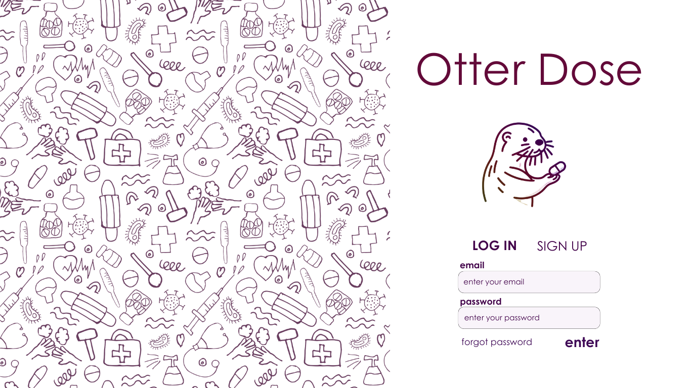
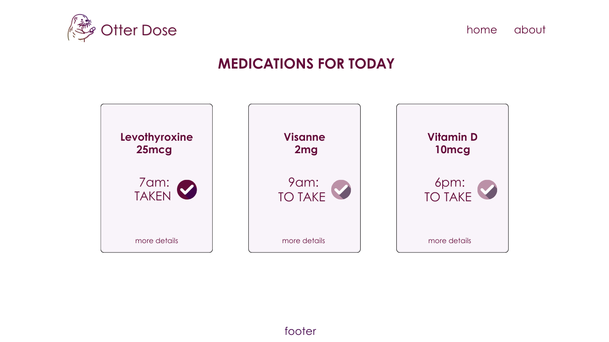
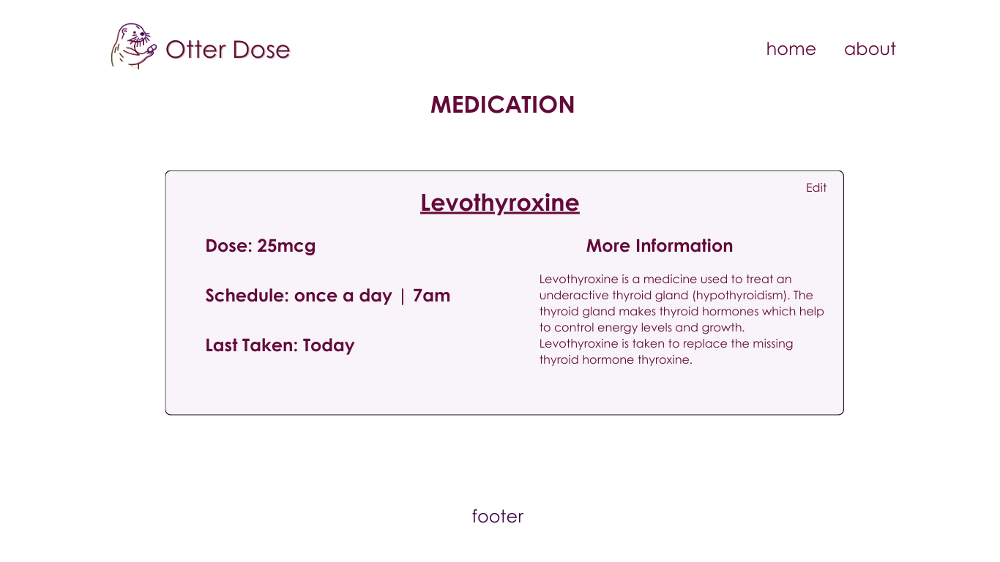
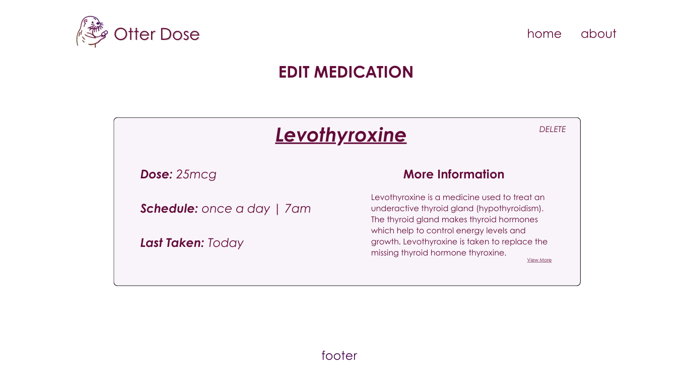
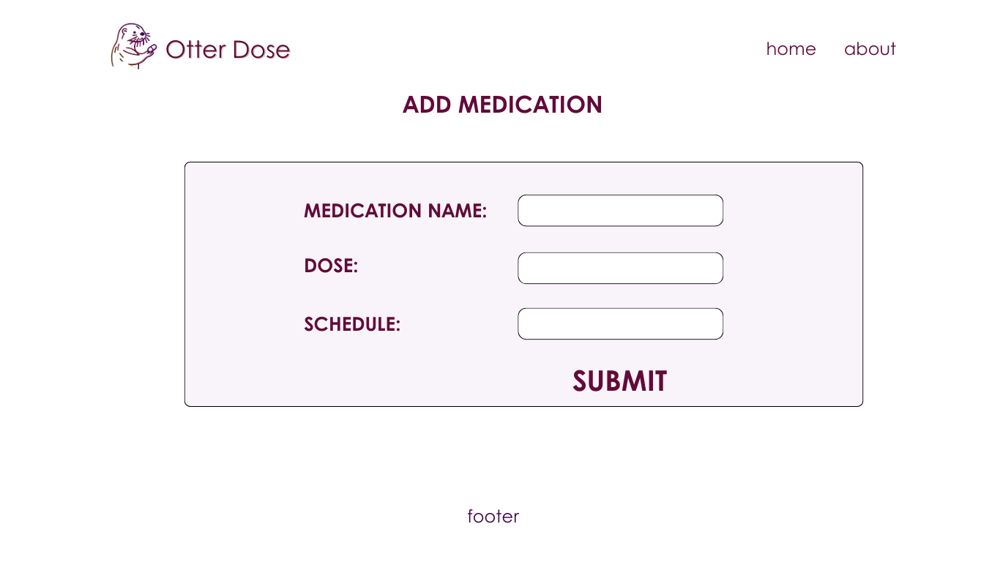
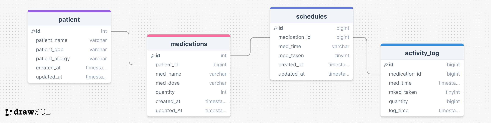

# Project Title

Otter Pill

## Overview

Otter Pill is a responsive web application designed to simplify medication management and improve adherence to prescribed treatments. It empowers individuals to confidently track their medications through a user-friendly interface accessible on tablets, desktops, and mobile devices.

### Problem

Many people struggle to remember to take their medications on schedule, leading to missed doses and potential health complications. Otter Pill tackles this issue by offering a convenient and intuitive solution for managing medications.

### Installation

1.  git clone this repository and open in VScode or 

```
git clone https://github.com/AanelyaA/capstone-medication
cd capstone-medication
```


2.  Once the repository is cloned, you can open it in Visual Studio Code by navigating to the directory and typing
```
code .
````
in the terminal. This command opens the current directory in Visual Studio Code.


3. Install dependencies:
```
npm i
```

4. follow this link to install the server and follow the instructions provided.
   [https://github.com/AanelyaA/medication-server](url)


5. Start the application using:
```
npm start
```

6. (Optional) NFC Functionality Instructions:
   To utilize the NFC functionality:
    - Ensure you have an NFC application capable of reading and writing NFC tags (e.g., "NFC Tools").
    - Read the NFC tag to verify it is clear.
    - Write the following URL to the NFC tag:
      ```
      http://yourIPAddress:8080/medications/nfc?id=IDMED&time=MEDTIME&taken=true
- Replace yourIPAddress with the IP address of your server and IDMED with the medication ID obtained from the medication detail page by pressing the otter image. MEDTIME should be the time you wish to set for the medication (e.g., 14:30).
- Once configured, tap the phone on the NFC tag and press the link when prompted.
- The medication status should update to "TAKEN" accordingly.

   
### User Profile

- Individuals managing their own medications.
- Caregivers assisting family members who may have difficulty managing medications.
- Parents managing medications for their children.
- Pet owners managing medications for their animals.

### Features

- Effortless Medication Tracking: Track medications with ease, adding details like name, dosage, schedule and additional notes (ex: "take with food").
- Clear Medication Schedule: View a clear and concise schedule of your upcoming medication doses, ensuring you never miss a dose.
- Simplified Intake Confirmation: Confirm medication intake with a click or tap with your phone via NFC, simplifying your routine.
- Medication History: Access medication history to monitor adherence patterns and track progress.
- Multiple Patients per Profile: allows users to create profiles for multiple individuals using medications (e.g., children, family members, pets).

## Implementation

### Tech Stack

Frontend: HTML, CSS, SASS, JavaScript, React
Backend: Express, Node.js
Database: MySQL
Client-side Libraries: Axios
Server Libraries: Knex, Express, Cron

### APIs

- NFC APIs: To enable tap-to-confirm functionality.

### Sitemap

- Home Page: Overview of medications, showing if they have been taken today or not
- Medication Detail Page: Detailed view of a specific medication, shows schedule, history
- Medication Edit Page: Edit medication details like dose, schedule, notes. Also allows to delete a medication if needed.
- Profile Page: Overview of all managed profiles (for a child, grandparent, yourself).
- Profile Edit Page: Edit profile details like name, allergies, primary doctor, date of birth. Also allows to delete a profile if needed.
- Register Page: User registration for creating an account.
- Login Page: User login for accessing the application.

### Mockups







### Data



### Endpoints

route("/")
  .get(findMedications)
  .post(addMedication)

route("/nfc")
    .get(markMedicationAsTakenWithNFC)

route("/:id")
  .get(findMedication)
  .delete(removeMedication)
  .put(updateMedication)

route("/log")
    .post(logActivity)

route("/log/:id")
    .get(getActivityLog)

route("/taken/:id")
    .put(markMedicationAsTaken)

route("/")
  .get(findPatients)
  .post(addPatient)

route("/:id")
  .get(findPatient)
  .delete(removePatient)
  .put(updatePatient)

route("/:id/medications")
  .get(findMedicationsByPatient)


### Auth

Time-Permitting: Otter Pill will utilize JWT (JSON Web Token) authentication for secure user login and access control and password hashing. Users will create accounts with usernames and passwords.

## Roadmap

- Sprint 1: Setup
1. Set up project structure, repository, and database schema.
1. Set up server structure and repository.

- Sprint 2: Medication Management
1. Develop frontend components for medication tracking, schedule display, and intake confirmation.
2. Create backend endpoints for CRUD operations on medications.

- Sprint 3: User Interface Refinement
1. Implement medication history feature to track adherence patterns.
2. Enhance User Interface: Improve the overall design and layout for better usability and accessibility, ensuring that the application is user-friendly across all devices.

- Sprint 4: Testing and Deployment
1. Conduct thorough testing of all features.
2. Address any identified issues and refine user experience.
3. Prepare for deployment and deploy Otter Pill web application.

## Nice-to-haves

Scan Medication/text recognition:
- Integrate a text recognition feature to allow users to scan medication bottle.
- This will allow a user to mark that medication as "taken" or can be used to create a new medication if it is not yet in the data.
- 
Lab Tracker:
- Integrate with lab result providers to allow users to securely import and store their lab test results within the app.
- Display historical lab results alongside medication data for a more comprehensive view of a user's health.

Authorization/Login
- Implement a basic user login functionality to allow users to create accounts and securely log in to access their medication information.
- Enhance login security with features like password hashing.

Forgot Password Feature:
- Implement a "Forgot Password" functionality to allow users to recover their accounts in case they forget their login credentials.
- This could involve sending a password reset link via email.

User Notifications:
- Implement a notification system to remind users to take their medications. This could include push notifications for mobile devices and email reminders.
